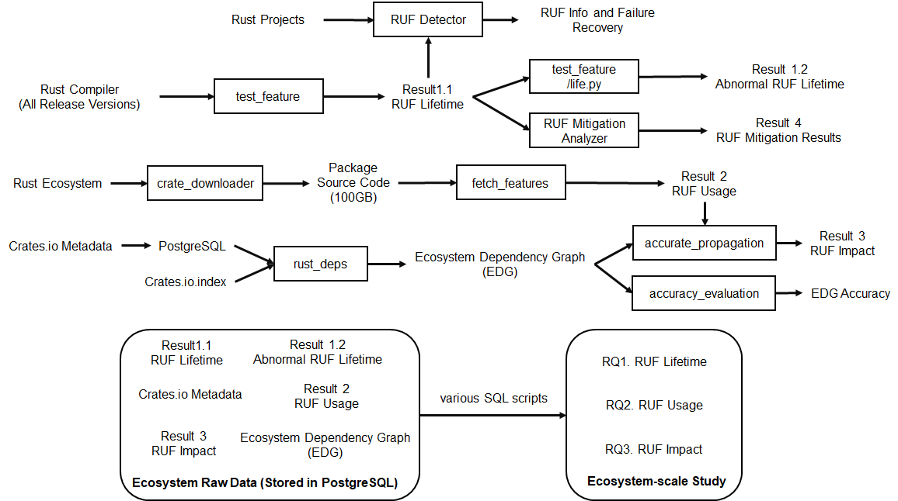

# Code

This directory contains multiple sub-projects for various analysis of the Rust ecosystem. All work should be done after the env build (Step 0) following the root directory guide.

The figure shows main tool structure of this project. 

- `accuracy_evaluation`: Evaluate the accuracy of our dependency resolution tool. Should be done after project `rust_deps`.
- `advisory_scanner`: Scan the advisory impact range across the Rust ecosystem according to provided advisory data in json file. Should be done after project `rust_deps`. This tool is not included in RUF study, but is extended for vulnerability study in the Rust ecosystem, and can reuse the exsisting architecture to achieve the goal.
- `cargo_ruf`: RUF detector of Rust projects. It now tries to recover packages that suffer from compilation failure due to RUF impacts. It can be integrated into Cargo.
- `crate_downloader`: It is used to download source codes of all Rust packages.
- `demo`: For private test only. Should not be used.
- `nightly_propagation`: RUF analysis tools.
  - `accurate_propagation`: Accurately evaluate the impacts of RUF. Should be done after project `rust_deps` and `fetch_features`.
  - `fetch_features`: Fetch RUF configuration defined by crates in the Rust ecosystem. Should be done after project `crate_downloader`.
  - `ruf_mitigation_analysis`: It scans the whole Rust ecosystem to analyze how many packges can recover from RUF threats, like compilation failure. It is a validation tool to estimate the success rate of `cargo_ruf`.
  - `run_propagation`: Deprecated. Should not be used.
  - `test_feature`: RUF lifetime analysis. This project scans the Rustc source code and extract RUF definition information. It can also further analyze the abormal RUF lifetime and virtualise it.
- `rust_deps` (First): Rust Ecosystem Dependency Graph (EDG) Generator. It is recommended that you first read this project to build the EDG.
- `scripts`: SQL scripts to prebuild databse and analyze the Crates database. After building all necessary database, you can use SQL scripts here to generate "research results" here.

Execution flow dependency:

1.1 rust_deps         -> 1.2 accuracy_evaluation (Ensure correctness)   -> 1.3 accurate_propagation

2.1 crate_downloader  -> 2.2 fetch_features -> 1.3

3.1 test_feature      -> 1.3
