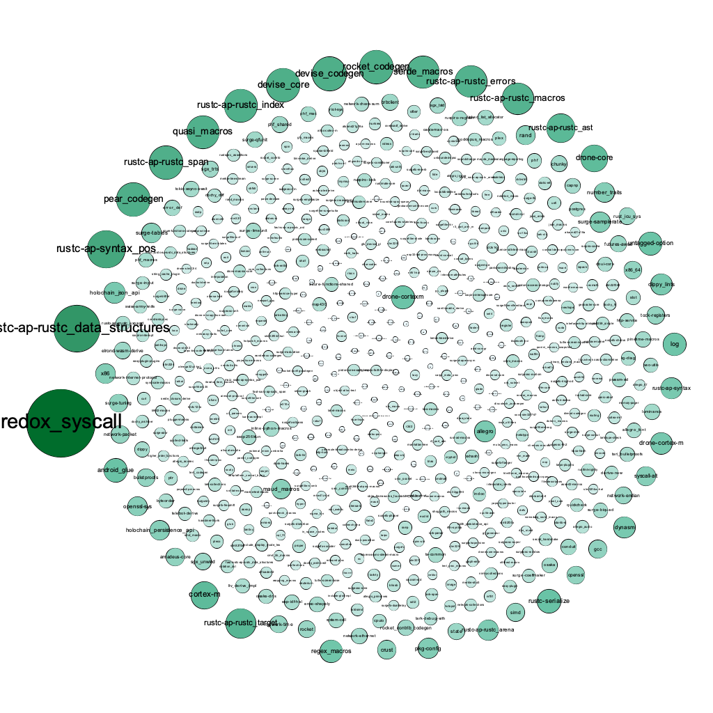
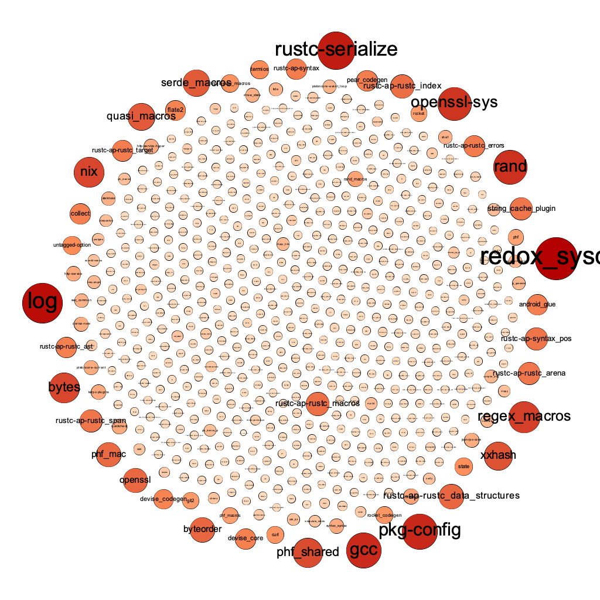
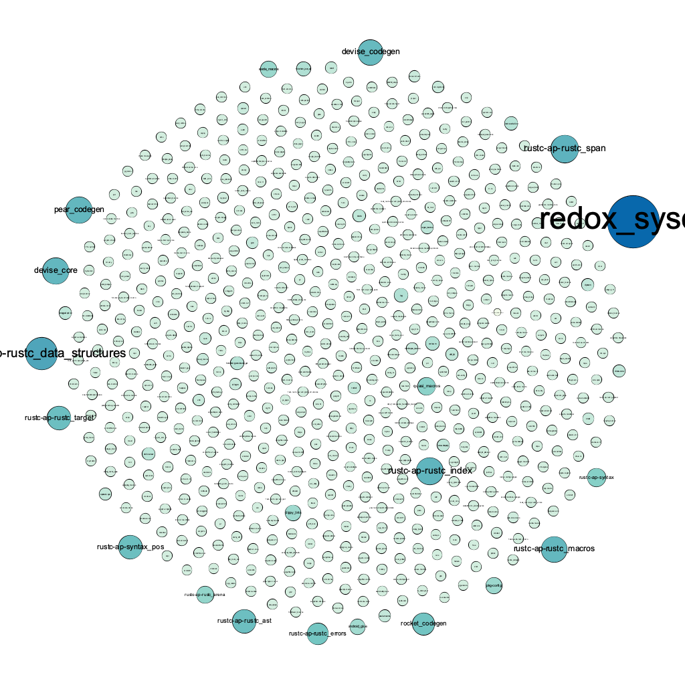
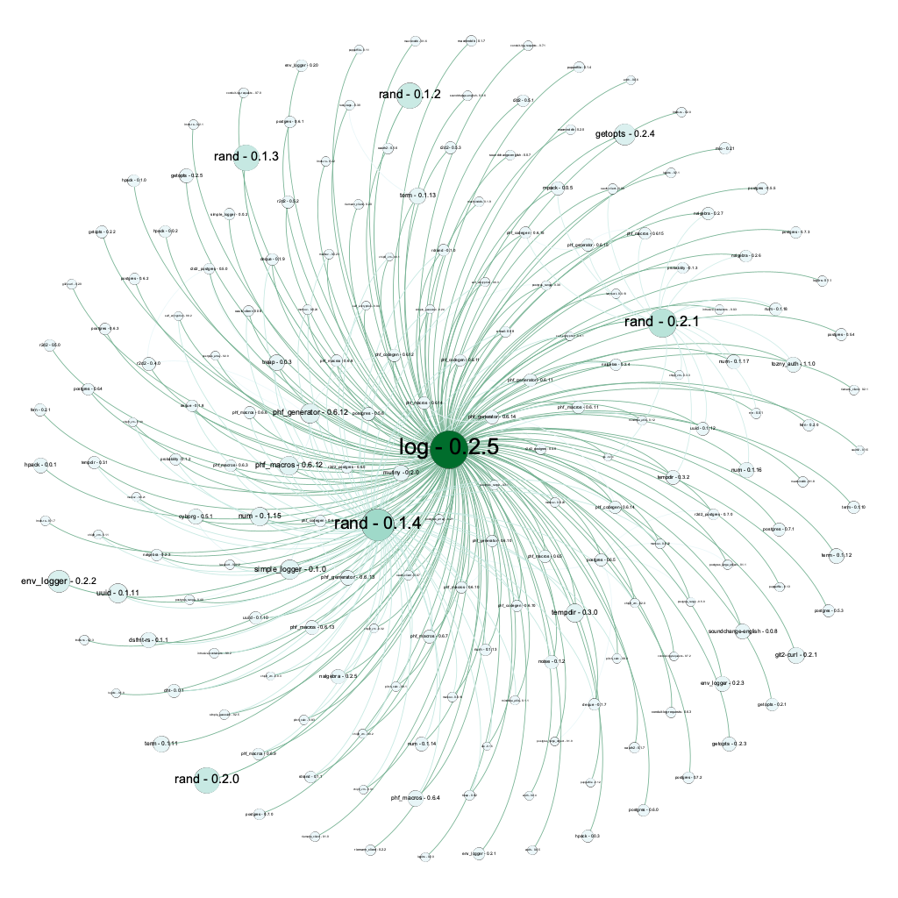
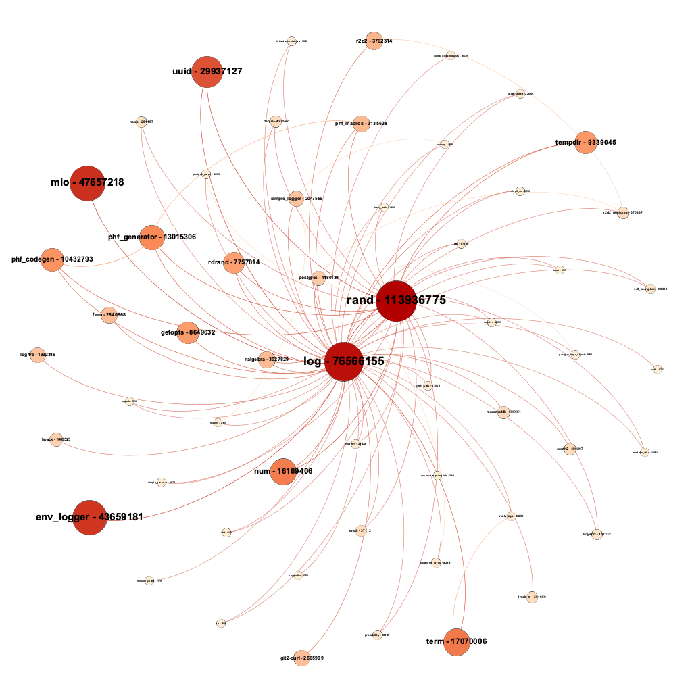
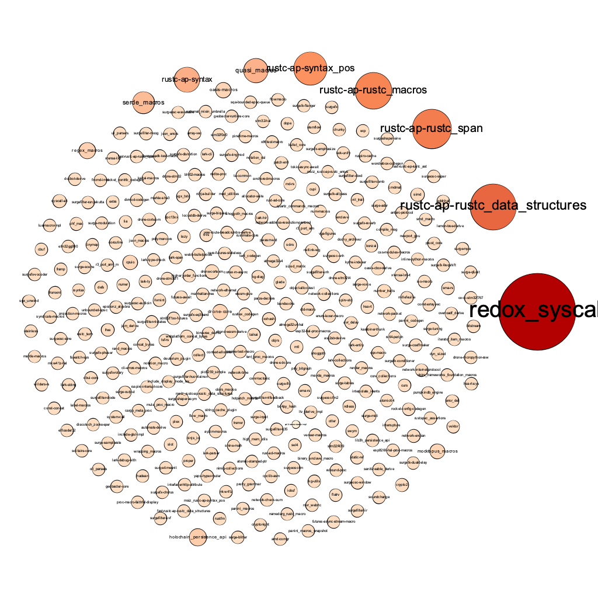
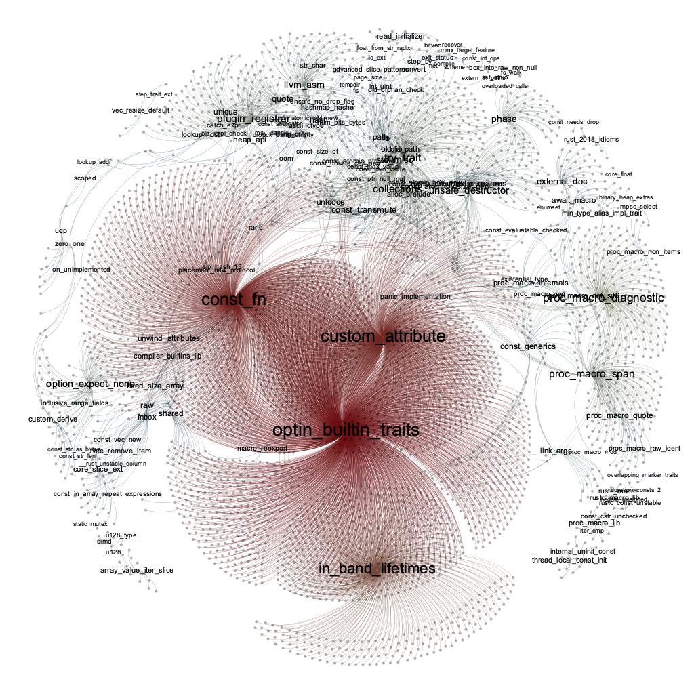

# Nightly feature propagation

[TOC]

## Background

Rustc is Rust's compiler, available in Stable, Beta, and Nightly. According to software engineering conventions, project developers should ensure that their projects can successfully compile using the stable compiler. However, since Rust is fairly new, developers usually prefer to use the Nightly (unstable) version to gain additional feature support. This is fairly common in many packages released on Cargo (the Rust package manager). The Nightly compiler provides some compiler-level features to enable special features that are unstable and likely to be deprecated or unsupported later. And developers who rely on these libs force the project to use the Nightly compiler. These have brought potential dangers to Rust ecology, and we need quantitative analysis to determine the scope of impact.


## Path

A feasible but maybe naive path:

1. Crawls the source code for all of Cargo ecology's libraries.
2. Extract the enabled Nightly feature in the source code.
3. Test whether these features are obsolete or still functional.
4. Analyze how many libraries are affected by the Nightly features.


Current implementation may also be naive:

- Start data can be found at `https://static.crates.io/db-dump.tar.gz`. All crates and versions info can be found here.
- Postgres as backend.

- Source code can be reached by API: `https://crates.io/api/v1/crates/$(crate)/$(version)/download`.
  - [downloader](https://crates.io/crates/downloader) is used to fetch crates.
- Use regex to extract used nightlt feature: `//.*|#!\[feature\((.*?)\)\]`. Careful, `annotaions` shall be skipped.


A crucial problem, regex fails to deal with `/* */` annotation format. Should use `/\*[\s\S]*\*/|//.*|#!\[feature\((.*?)\)\]` .

- And from this, I find it’s really headache to acurately extract a feature by regex, since crates write feature declaration in all kinds. But no worry, strange forms of feature declaration are not common, and I believe major crates will write their feature declaration well.
- Use rustc to detect features can be more appropriate, and can spontaniously test whether the feature useable or not. However, the problem is, I don’t have enough time to figure out how to use rustc to do static analysis and give out the features a version use and whether the features functional or not. A naive way is, complile the crates, but yes, too naive.


Pipeline details:

1. traverse all crates (table ‘crates’ contains these info), and get all versions a crate has (table ‘versions’ contains these info).
2. for each crate, use a donwloader to download all versions’ source code of it.
3. for each version, use regex to extract nightly feature used by it ([flate2](https://crates.io/crates/flate2) and [tar](https://crates.io/crates/tar) can be helpful, since source code file is compressed).
4. store the data into postgres ([postgres](https://crates.io/crates/postgres) may be helpful).


Pipeline overview:


## Analysis

>  Our start data are 3-15’s database dump.


### Overview

Among the `830` features:

- `596` features are still functional, and `305` of them have already been stablized.
- `189` features are unknown, and could not be compiled.
- `38` features have been removed, could not be compiled.
- `6` features are still incomplete, shall be careful to use.
- `staged_api` ? Assume ok.


Some basic info:

- Version coverage: `509285 / 509441 = 99.97%`
- `36498` versions have used features, with `830` features types, these versions comes from `5535` crates.

- Total downloads are `162882210`, that’s `162882210 / 14269689275 = 1.14%` of the ecology.
- `17233` versions used unknown or removed features that cannot be compiled, that’s `3.38%` of all versions.


How failed features spread:

- In 03-15 index, `4058` versions (belongs to `658` crates) are relied by other crates.
- These versions indirectly affected `145035` versions. Including previous bad versions, `146932` versions in total may not be compiled, `28.84%` of all versions.
- The donwloads are `929543293`, that’s `6.51%` of total downloads.
  - Some new verison may have low downloads number, thus maybe we shall use crates donwloads to represent a version’s impact.
  - And if so, the total donwloads are `2758826355` downloads, and that’s `19.30%` of total downloads.


Two standards:

- total impacted version donwloads - actual impact caused in the ecology.
- total impacted crates downloads - importance of this crates in the ecology.


### Source Version View

Among the versions that use failed features(source version), we have a graph describes the impact of the version(crates):



- For `redox_syscall` only, it affects `136028` versions in total, that’s `26.70%` of all versions. And total version downloads of impacted crates are `902113863`, `6.32%` of all donwloads, and total crates donwlod of impacted crates are `1536015810`, `10.74%` of all downloads.
  - However, this crate seems to be used only when compiled on redox OS, thus it does not cause great impact on the ecology.
  - Thought, still shall be careful with it.

- If we discount this crates(redox OS is not commonly used), only `12166` versions are affected, but crates donwloads are still considerable.


Let’s use crates donwloads (including impacted versions) as weight and draw a graph again:



The result is quite shocking, many well-known crates appears in it. But don’t worry, let’ use version downloads as weight instead:



We can see that, though impacted crates have great donwloads, but when we come to the impacted version exactly, the total downloads shrink.

Why? We take log as example. Following is a graph describe versions impacted by log-0.2.5:



And this is a gpraph describe crates impacted by log-0.2.5:



And then we find why: old version of log have also been widely used in other big crates’ old versions and some small crates. Thus the total crates donwload can be huge, while version downloads is small.


From this phenomenon, a question arises: do those fialed version actually in used? 

Or, do these crates have updated and fixed the old versions?


As we mentioned above, these source failed versions comes from `4058` versions or `658` crates:

- Among the `4058` failed versions, `344` versions are the latest, which is to say, `344` crates haven’t updated their versions, and problems remain. 
- As for the remaining `314` crates, they did update their versions, however, only `262` of them can be compiled actually. The other `52` of them still have problems in code.


Let’s dive into those non-updated `344` crates:

- Total donwloads of these crates are `33433650`, only less than `0.3%` of the total downloads.
- As for their propagation, they indirectly impact `141783` versiosn, and total versions downloads are `908749138`, also a huge part of the ecology.


To further explore, I draw a gprah of these crates (impacted crates downloads as weight):

```sql
SELECT name,sum(downloads) FROM 
(SELECT DISTINCT name,version_to FROM dep_feature_with_name WHERE name in (SELECT DISTINCT name FROM sversion_impact WHERE latest = true)) as t1 JOIN versions on t1.version_to = versions.id
GROUP BY name ORDER BY sum desc
```



we have discussed `redox_syscall` before, and there are some new crates appears here:

- `rustc-ap-*` is crates automatically maintained by rust, but seems cannot be compiled.
- What are they? How they impact?


### All Failed Version View

This is also an intersting part.


### Feature View

As we said before, `830` feature types are found in 03-15 ecology:

- `596` features are still functional, and `305` of them have already been stablized.
  - These features can be safely used and compiled.
- `38` features have been removed, could not be compiled.
- `189` features are unknown, and could not be compiled.
  - Why unknown features are used? Why unknown?
- `6` features are still incomplete, shall be careful to use.
  - They may be unstable, and possibly cannot be compiled or cause some other problems.


To visulize, we draw a graph describes how these failed features (unknown and removed) spread in source versions:




## Existing Problems

1. Accuracy may not be high enough, for example, `cfg_attr` is not taken into consideration.
1. Biased, shall use crates’ newest version.


## Other thoughts

有些 crates 要求特定版本的 rust，那么如果版本不同，会冲突吗？

为什么明明有依赖，编译的时候却没有编译呢？
