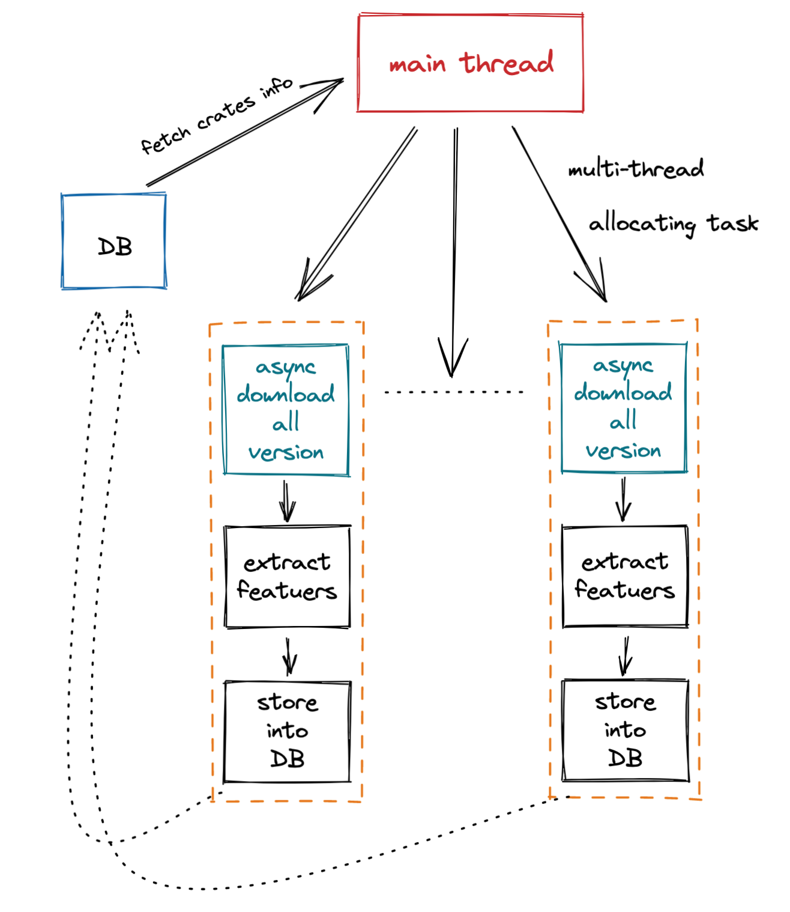

# Nightly feature propagation

## Background

Rustc is Rust's compiler, available in Stable, Beta, and Nightly. According to software engineering conventions, project developers should ensure that their projects can successfully compile using the stable compiler. However, since Rust is fairly new, developers usually prefer to use the Nightly (unstable) version to gain additional feature support. This is fairly common in many packages released on Cargo (the Rust package manager). The Nightly compiler provides some compiler-level features to enable special features that are unstable and likely to be deprecated or unsupported later. And developers who rely on these libs force the project to use the Nightly compiler. These have brought potential dangers to Rust ecology, and we need quantitative analysis to determine the scope of impact.


## Path

A feasible but maybe naive path:

1. Crawls the source code for all of Cargo ecology's libraries.
2. Extract the enabled Nightly feature in the source code.
3. Test whether these features are obsolete or still functional.
4. Analyze how many libraries are affected by the Nightly features.


Current implementation may also be naive:

- Start data can be found at `https://static.crates.io/db-dump.tar.gz`. All crates and versions info can be found here.
- Postgres as backend.

- Source code can be reached by API: `https://crates.io/api/v1/crates/$(crate)/$(version)/download`.
  - [downloader](https://crates.io/crates/downloader) is used to fetch crates.
- Use regex to extract used nightlt feature: `//.*|#!\[feature\((.*?)\)\]`. Careful, `annotaions` shall be skipped.


A crucial problem, regex fails to deal with `/* */` annotation format. Should use `/\*[\s\S]*\*/|//.*|#!\[feature\((.*?)\)\]` .

- And from this, I find it’s really headache to acurately extract a feature by regex, since crates write feature declaration in all kinds. But no worry, strange forms of feature declaration are not common, and I believe major crates will write their feature declaration well.
- Use rustc to detect features can be more appropriate, and can spontaniously test whether the feature useable or not. However, the problem is, I don’t have enough time to figure out how to use rustc to do static analysis and give out the features a version use and whether the features functional or not. A naive way is, complile the crates, but yes, too naive.


Pipeline details:

1. traverse all crates (table ‘crates’ contains these info), and get all versions a crate has (table ‘versions’ contains these info).
2. for each crate, use a donwloader to download all versions’ source code of it.
3. for each version, use regex to extract nightly feature used by it ([flate2](https://crates.io/crates/flate2) and [tar](https://crates.io/crates/tar) can be helpful, since source code file is compressed).
4. store the data into postgres ([postgres](https://crates.io/crates/postgres) may be helpful).


Pipeline overview:




## Analysis

>  Our start data are 3-15’s database dump.


Some basic info:

- Version coverage: `509285 / 509441 = 99.97%`

- `36498` versions have used features, with `830` features types

  ```sql
  SELECT DISTINCT id FROM version_feature WHERE feature != 'no_feature_used'
  ```

- These versions comes from `5535` crates

  ```sql
  SELECT COUNT(DISTINCT crate_id) FROM versions WHERE id in (SELECT DISTINCT id FROM version_feature WHERE feature != 'no_feature_used')
  ```

- Total downloads are `162882210`, that’s `162882210 / 14269689275 = 1.14%` of the ecology

  ```sql
  SELECT sum(downloads) FROM versions WHERE id in (SELECT DISTINCT id FROM version_feature WHERE feature != 'no_feature_used')
  ```


Among the `830` features:

- `618` features are still functional, and `334` of them have already been stablized.
- `167` features are unknown, and could not be compiled.
- `38` features have been removed, could not be compiled.
- `6` features are still incomplete, shall be careful to use.
- `staged_api` ?


How it spread:


## Existing Problems

1. Accuracy may not be high enough, for example, `cfg_attr` is not taken into consideration.


## Other thoughts

有些 crates 要求特定版本的 rust，那么如果版本不同，会冲突吗？
